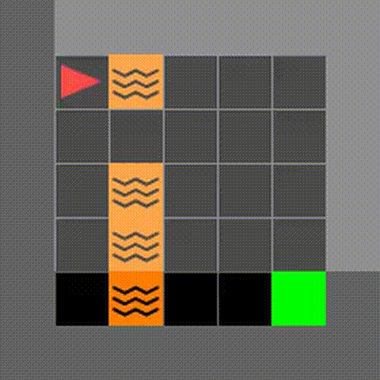

# Safe Reinforcement Learning with Action Masking

## Overview
This project investigates the trade-off between **safety and exploration** in reinforcement learning. We compare multiple PPO-based approaches for enforcing safety in constrained environments using the MiniGrid LavaGap benchmark.



We evaluate:
- **Vanilla PPO** (baseline)
- **Penalty-based PPO**
- **Penalty PPO with adjacent penalty**
- **Hard Action Masking (MaskablePPO)**
- **Soft Action Masking**
- **Hybrid Masking (masking + penalties)**

The goal is to understand how different safety mechanisms affect:
- learning performance
- convergence speed
- safety violations
- generalization

---

## Installation

```bash
git clone https://github.com/Marsak24/safe-rl-action-masking
cd safe-rl-action-masking
pip install -r requirements.txt
````

---

## Project Structure

```
agents/      # training scripts for all methods
env/         # environment wrappers (masking, penalties)
metrics/     # evaluation, logging, plotting
results/     # experiment outputs
tests/       # unit tests
```

---

## Training

### Vanilla PPO

```bash
python agents/train_ppo_multi_env_logging.py
```

### Penalty PPO

```bash
python agents/train_penalty.py
```

### Hard Masking

```bash
python agents/train_masked_ppo.py
```

### Soft Masking

```bash
python agents/train_soft_masked_ppo.py
```

---

## Evaluation

```bash
python metrics/evaluation.py
```

---

## Outputs

Each run produces:

* Training logs (CSV)
* Evaluation metrics (reward, success rate, violations)
* Aggregated summaries across seeds
* Plots (learning curves, convergence)
* Visitation heatmaps
* Videos of agent behavior

---

## Environments

* MiniGrid-LavaGapS5-v0
* MiniGrid-LavaGapS6-v0
* MiniGrid-LavaGapS7-v0

Additional:

* LavaCrossing environments (for generalization)

---

## Authors

* Marwah Al Sakkaf
* Sara Ibrahim
* Rawan Darwich
* Haifa Naim

## Detailed Training Results and Plots

[Resullts](https://mailaub-my.sharepoint.com/:f:/g/personal/shi12_mail_aub_edu/IgBuB5hg8Z3NQZLDu0Gp4B0VAYFsbAECKZFIwUh6kWbEHfk?e=JecLBw)
---
